# Mermaid Diagrams

## Slide 1: Mermaid (overview)
Slide ID: DC5E2A37-6C2D-4079-8E2B-60641ED13F77

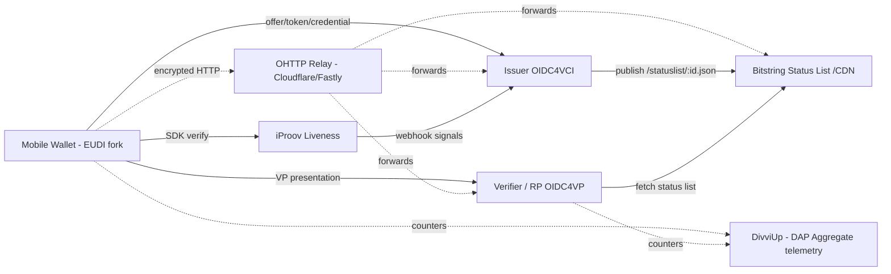

## Slide 2: Mermaid (wallet interactions)
Slide ID: 62DC281A-5983-4799-985A-E22803250033

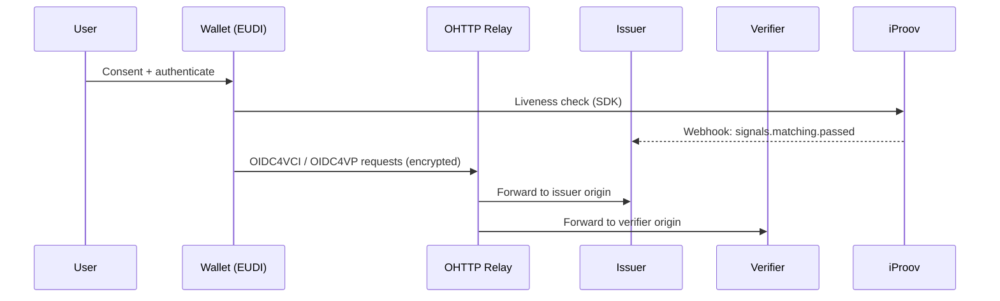

## Slide 3: Mermaid (issuance pipeline)
Slide ID: 934F311B-EFFD-4ACC-B26C-586C9AE55599

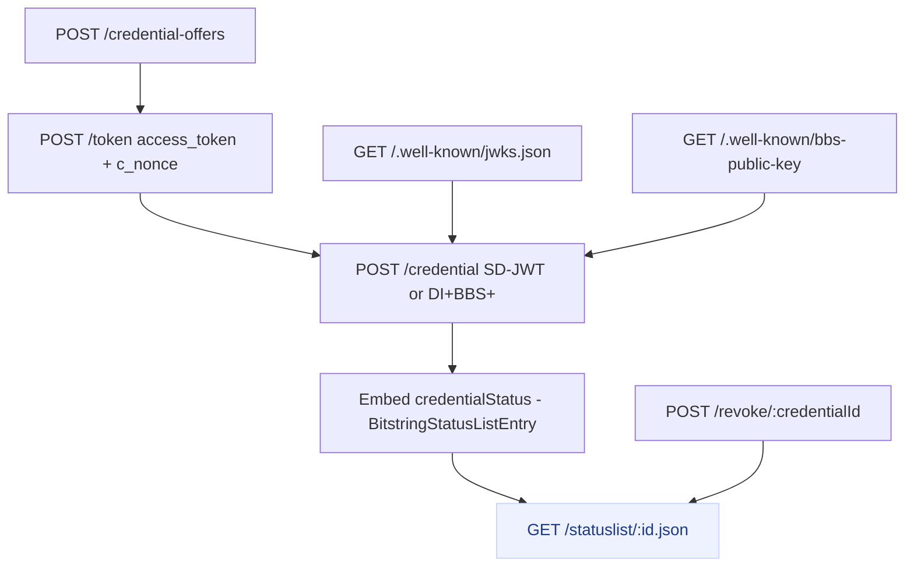

## Slide 4: Mermaid (verification flow)
Slide ID: F99C533B-A274-4405-A8B7-9117EC033D8E

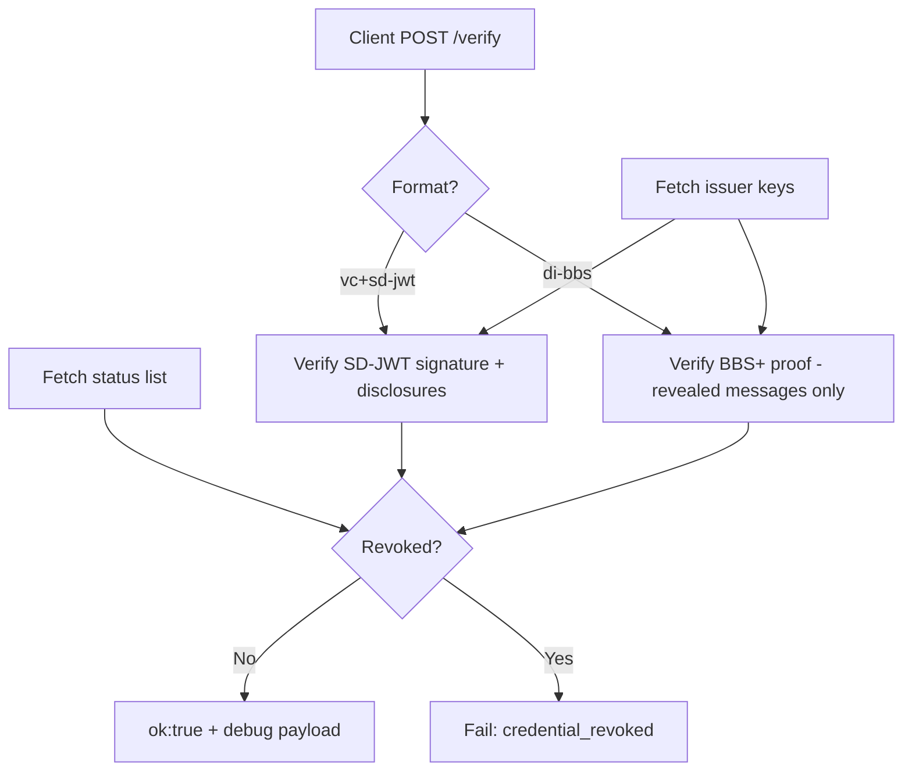

## Slide 5: Mermaid (OHTTP path)
Slide ID: 127B6F9A-7ED2-4800-A529-EE9A94FAC8B0

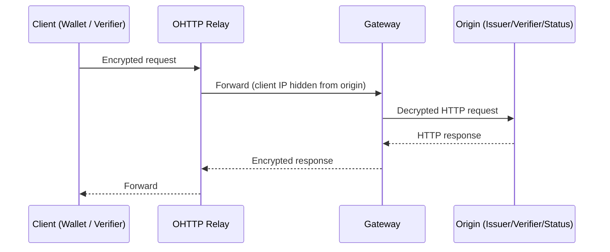

## Slide 6: Mermaid (liveness gating)
Slide ID: E577ABB3-E25D-4AA9-80D5-3C0D51946E6C

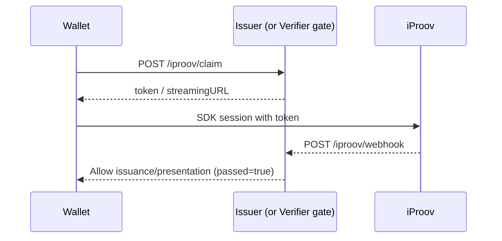

## Slide 7: Mermaid (status list check)
Slide ID: 00EA8CF8-D3DC-4415-A1EF-D10AA3D08F21

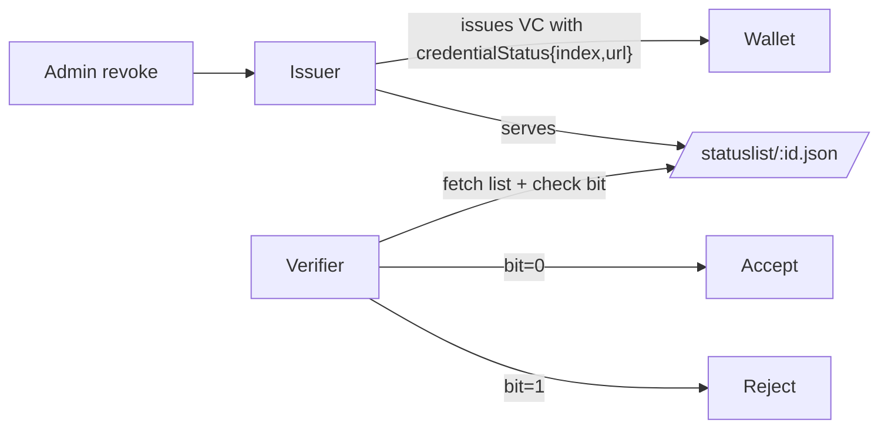

## Slide 8: Mermaid (BBS+ selective disclosure)
Slide ID: E5B4FC62-795C-4B8A-979B-8FD5F0A30106

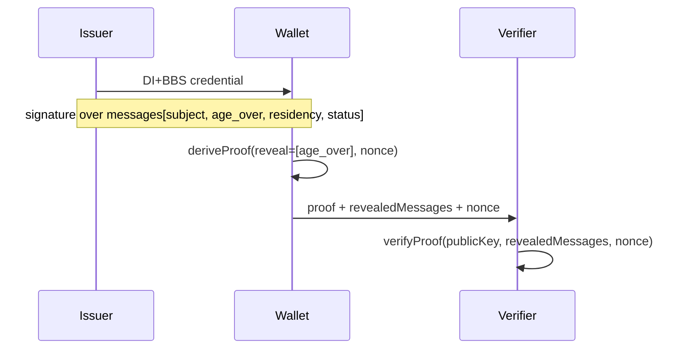

## Slide 9: Mermaid (aggregate-only telemetry)
Slide ID: 07029CCF-366F-4842-A301-19C6E03D5807

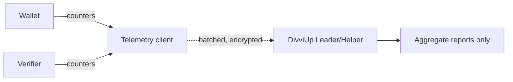

## Slide 10: Mermaid (origin-bound presentation)
Slide ID: A407D35B-61C5-4D8C-B5FE-576D025ED87F

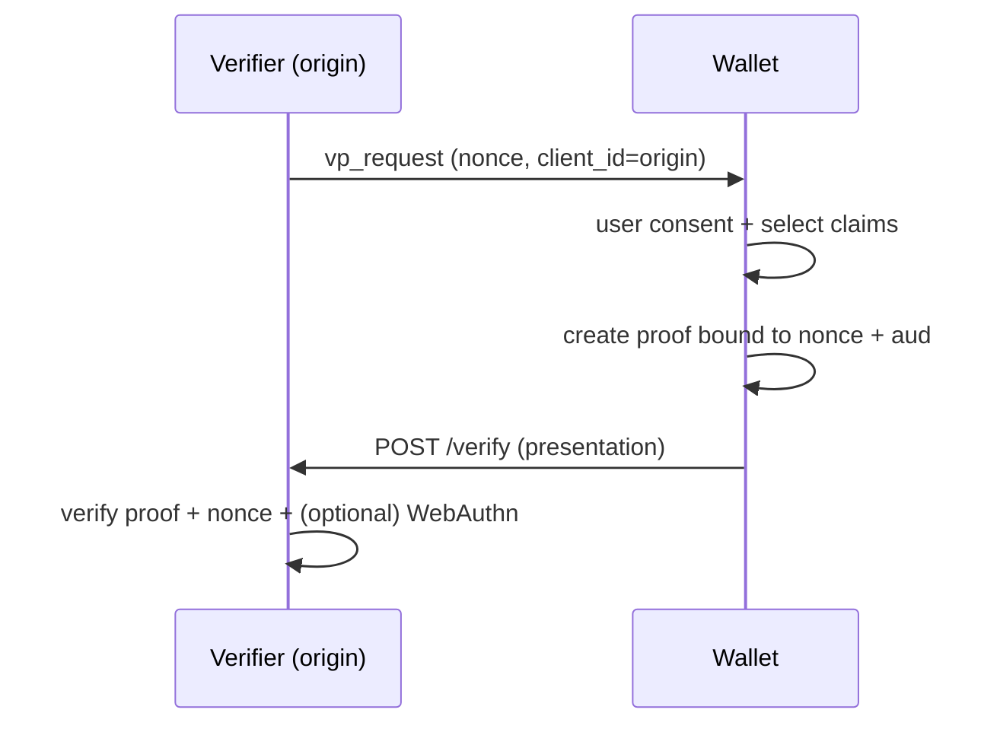

## Slide 11: Mermaid (lab progression)
Slide ID: CACA70AF-BAD7-4CFF-B44F-7A325BA659D7

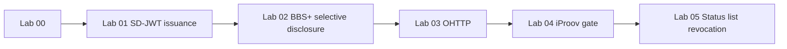
